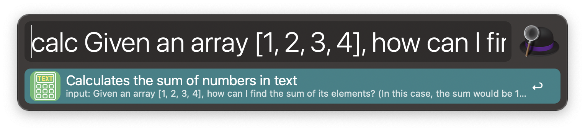
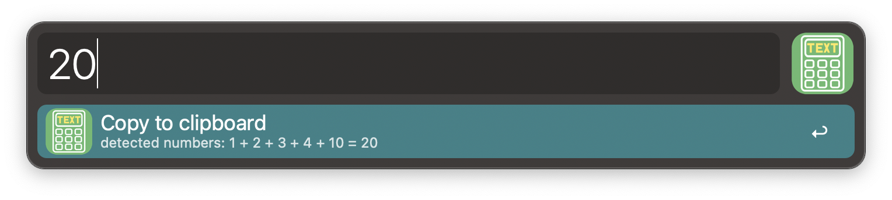

# Alfred-workflow-text-calculate
An Alfred workflow to calculate text

# Introduction

Calculates the sum of numbers contained within text.

# Usage

Trigger the workflow by typing the keyword (the default is `calc`).

Example Input:
```
Given an array [1, 2, 3, 4], how can I find the sum of its elements? (In this case, the sum would be 10.)
```


Result: 
```
20 (1 + 2 + 3 + 4 + 10)
```


- Line break compatible
- Comma separated number compatible
- Output comma separated number by default